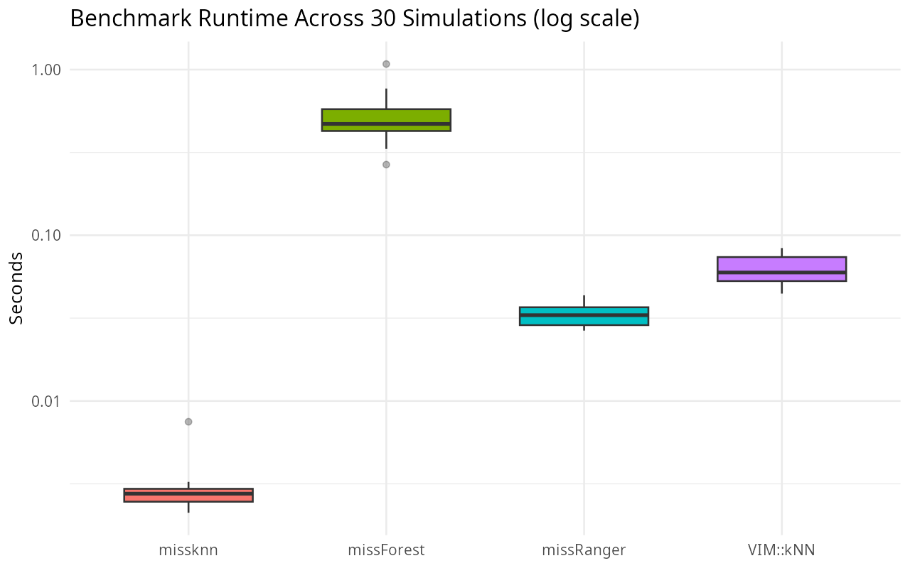
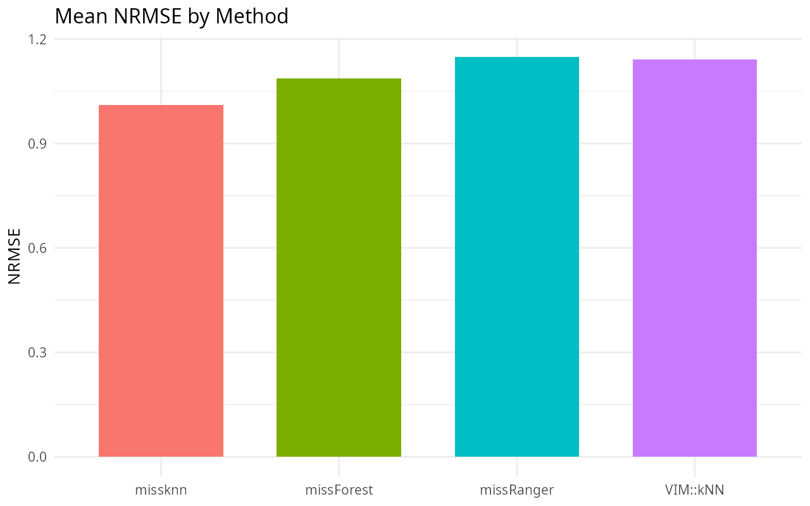
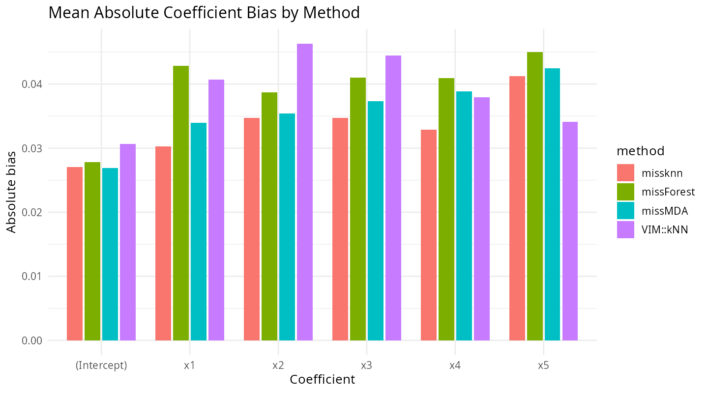
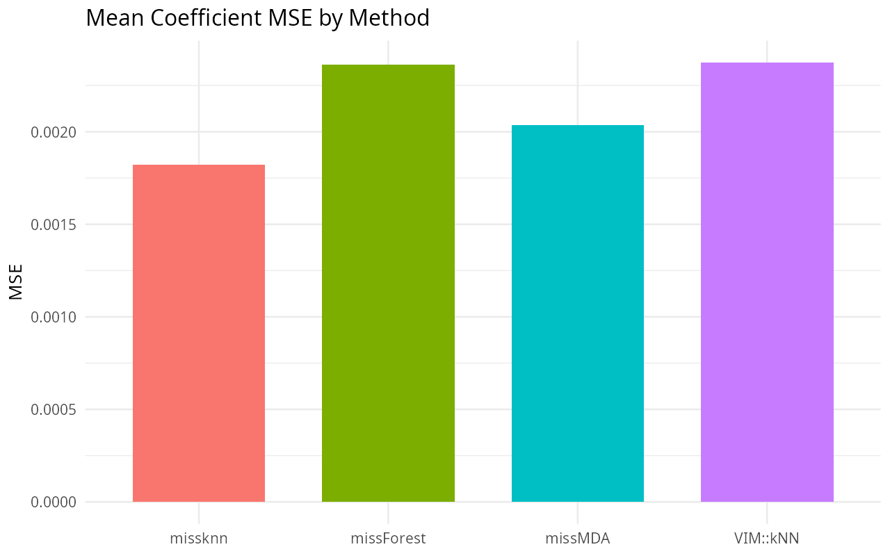

# missknn Benchmark Report

30 simulations, MCAR amputation from `mimar`, `bench::mark` for runtime.
Two kinds of accuracy are reported: NRMSE (Stekhoven & Buhlmann 2012),
measuring imputation accuracy on the predictors directly, and downstream
OLS coefficient bias/MSE, measuring how imputation error propagates into
a regression fit on the imputed data -- the original evaluation design
from the missForest paper.

## Figures

## Runtime Table

Table: Mean runtime across 30 simulations

|method     | runtime_sec| sd_runtime|
|:----------|-----------:|----------:|
|missknn    |      0.0028|     0.0009|
|missForest |      0.5111|     0.1677|
|missRanger |      0.0333|     0.0049|
|VIM::kNN   |      0.0632|     0.0117|

## NRMSE Table

Table: Mean NRMSE (imputed predictors, pooled) across 30 simulations

|method     |  nrmse|
|:----------|------:|
|missknn    | 1.0109|
|missForest | 1.0870|
|missRanger | 1.1484|
|VIM::kNN   | 1.1419|

## Downstream Coefficient Error Table

Table: Mean downstream OLS coefficient error across 30 simulations

|method     | abs_bias|    mse|
|:----------|--------:|------:|
|missknn    |   0.0316| 0.0016|
|missForest |   0.0356| 0.0020|
|missRanger |   0.0443| 0.0031|
|VIM::kNN   |   0.0401| 0.0024|

## Coefficient-Level Table

Table: Coefficient-level absolute bias and MSE

|method     |term        | abs_bias|    mse|
|:----------|:-----------|--------:|------:|
|missknn    |(Intercept) |   0.0277| 0.0011|
|missForest |(Intercept) |   0.0275| 0.0012|
|missRanger |(Intercept) |   0.0266| 0.0011|
|VIM::kNN   |(Intercept) |   0.0332| 0.0014|
|missknn    |x1          |   0.0258| 0.0010|
|missForest |x1          |   0.0371| 0.0018|
|missRanger |x1          |   0.0586| 0.0051|
|VIM::kNN   |x1          |   0.0410| 0.0025|
|missknn    |x2          |   0.0346| 0.0020|
|missForest |x2          |   0.0347| 0.0023|
|missRanger |x2          |   0.0409| 0.0027|
|VIM::kNN   |x2          |   0.0400| 0.0026|
|missknn    |x3          |   0.0372| 0.0019|
|missForest |x3          |   0.0436| 0.0027|
|missRanger |x3          |   0.0570| 0.0044|
|VIM::kNN   |x3          |   0.0491| 0.0033|
|missknn    |x4          |   0.0316| 0.0016|
|missForest |x4          |   0.0303| 0.0015|
|missRanger |x4          |   0.0375| 0.0021|
|VIM::kNN   |x4          |   0.0366| 0.0022|
|missknn    |x5          |   0.0323| 0.0018|
|missForest |x5          |   0.0402| 0.0026|
|missRanger |x5          |   0.0452| 0.0033|
|VIM::kNN   |x5          |   0.0407| 0.0025|

