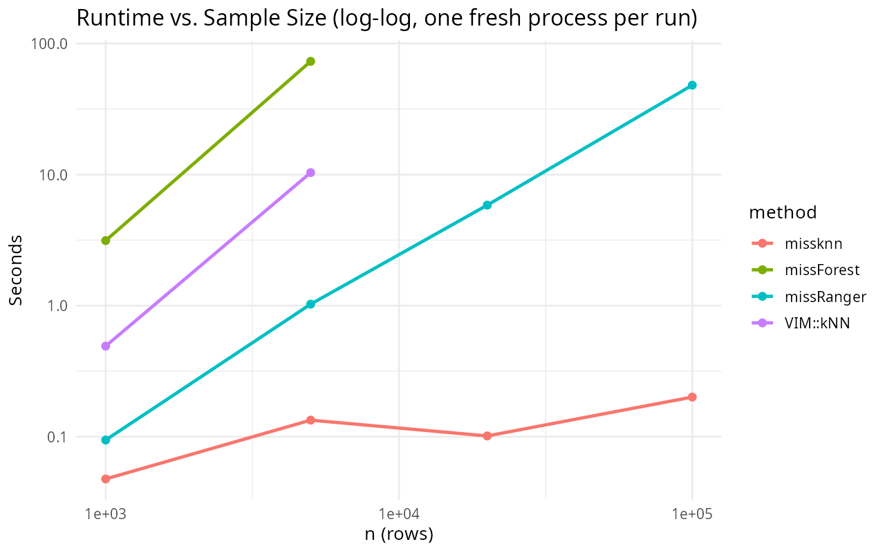
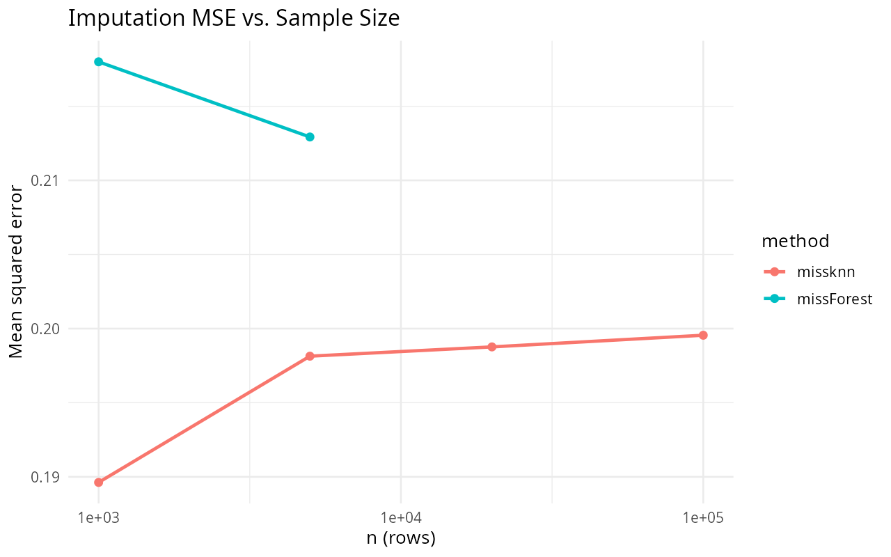

# missknn Big-Data Benchmark Report

Runtime and imputation accuracy vs. sample size, from n = 1,000 up to
n = 100,000 (5 numeric columns, 20% MCAR per column). Each (n, method) run
executes in its own fresh `Rscript` process, so timings are not distorted
by heap growth accumulated across earlier, larger runs in a shared session.
`missForest` is only run up to n = 5,000 since its per-tree cost makes
larger n impractical; `missknn` runs across the full grid.

## Takeaway

`missForest`'s runtime already becomes impractical at n = 5,000 (over a
minute) and would take hours at n = 100,000, so no comparison point exists
for it beyond n = 5,000. `missknn`'s capped-donor masked-KNN search stays
close to linear in n and keeps running in well under a second per column
set even at n = 100,000, which is the practical point of the donor-cap
design: search cost does not grow with the full donor pool once n exceeds
the cap.

## Figures

## Results Table

Table: Runtime and MSE by method and sample size (one fresh Rscript process per run)

|     n|method     | runtime_sec|     mse|
|-----:|:----------|-----------:|-------:|
| 1e+03|missknn    |      0.0410| 0.18962|
| 1e+03|missForest |      4.2753| 0.21800|
| 5e+03|missknn    |      0.1272| 0.19814|
| 5e+03|missForest |     69.0723| 0.21293|
| 2e+04|missknn    |      0.0949| 0.19876|
| 1e+05|missknn    |      0.1423| 0.19955|

