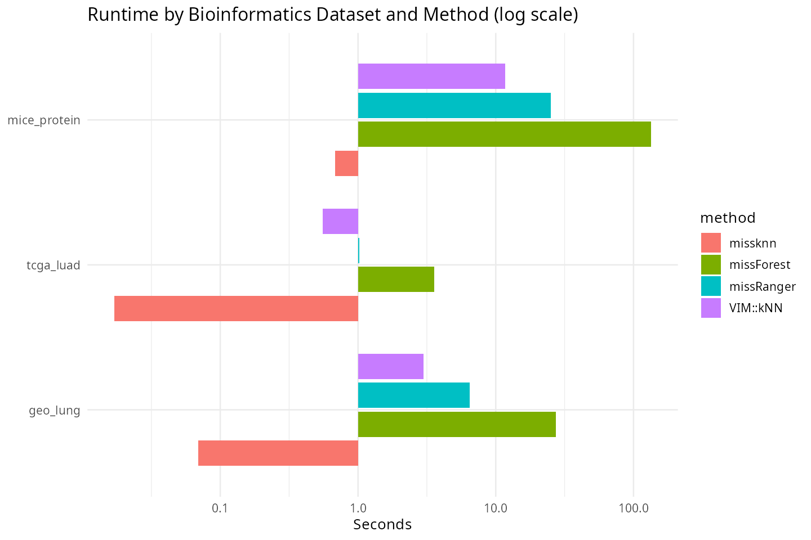
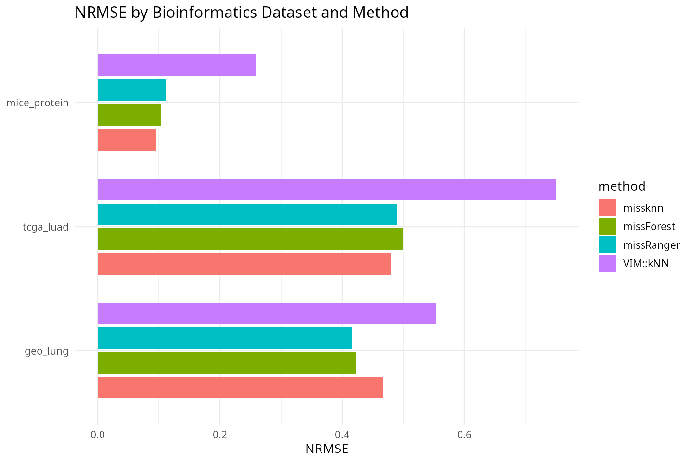

# missknn Bioinformatics Benchmark Report

Metrics follow Stekhoven & Buhlmann (2012): NRMSE for numeric variables
and PFC (proportion falsely classified) for categorical variables, both
pooled across every artificially-masked entry of that type rather than
averaged per column first. 30% MCAR imposed on complete-case/fully-observed
ground truth for each dataset.

## Dataset selection

Three datasets sourced from genomics/proteomics/microarray repositories
(not the `biostatlab` clinical panel used in the CIBM submission), to
match a Bioinformatics-journal audience:

- `mice_protein`: UCI Mice Protein Expression (protein/phosphoprotein
  assay levels in mouse cortex; real assay-dropout missingness).
- `tcga_luad`: TCGA Lung Adenocarcinoma PanCancer Atlas clinical/genomic
  summary panel (age, stage, grade, mutation burden, survival), via
  cBioPortal.
- `geo_lung`: GSE10072 lung cancer microarray (Affymetrix HG-U133A),
  top-100-variance probes + phenotype (cancer/normal, sex, smoking).

## Figures

## Main Results Table

Table: Runtime, NRMSE, and PFC on bioinformatics datasets (30% MCAR)

|dataset      |method     |   n|   p| runtime_sec|  nrmse|    pfc|
|:------------|:----------|---:|---:|-----------:|------:|------:|
|mice_protein |missknn    | 552|  81|       0.680| 0.0957| 0.0129|
|mice_protein |missForest | 552|  81|     134.095| 0.1040| 0.0113|
|mice_protein |missRanger | 552|  81|      24.982| 0.1115| 0.0129|
|mice_protein |VIM::kNN   | 552|  81|      11.653| 0.2583| 0.0194|
|tcga_luad    |missknn    | 426|  10|       0.017| 0.4803| 0.4123|
|tcga_luad    |missForest | 426|  10|       3.570| 0.4988| 0.4757|
|tcga_luad    |missRanger | 426|  10|       1.018| 0.4897| 0.4328|
|tcga_luad    |VIM::kNN   | 426|  10|       0.553| 0.7502| 0.4478|
|geo_lung     |missknn    | 107| 104|       0.069| 0.4667| 0.5917|
|geo_lung     |missForest | 107| 104|      27.437| 0.4217| 0.5083|
|geo_lung     |missRanger | 107| 104|       6.452| 0.4159| 0.5167|
|geo_lung     |VIM::kNN   | 107| 104|       2.988| 0.5543| 0.6250|

