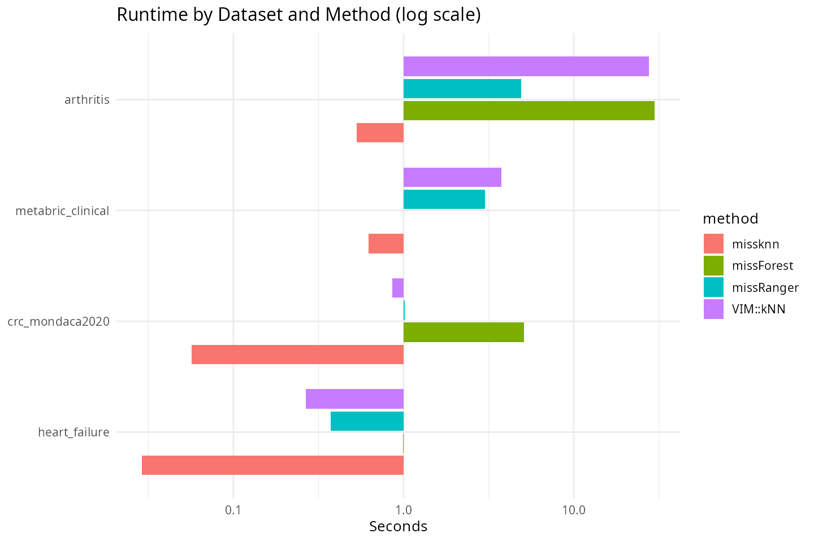
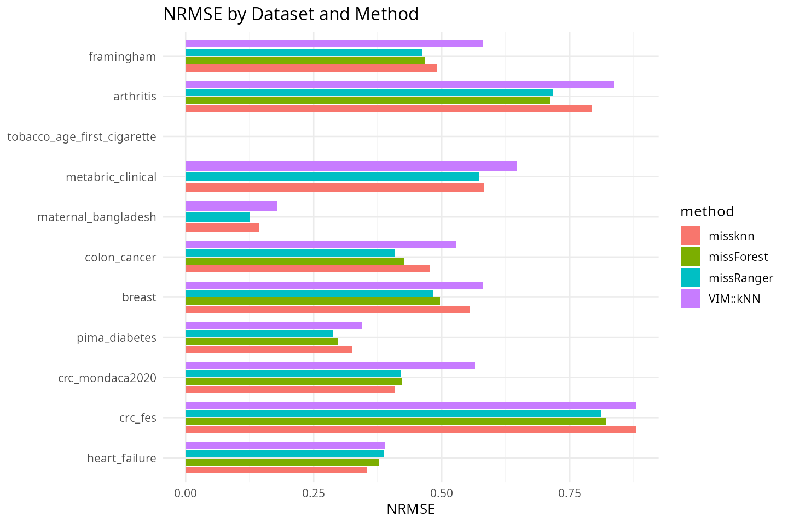

# missknn Real-Data Benchmark Report

Metrics follow Stekhoven & Buhlmann (2012): NRMSE for numeric variables
and PFC (proportion falsely classified) for categorical variables, both
pooled across every artificially-masked entry of that type rather than
averaged per column first. 20% MCAR imposed on complete-case ground
truth for each dataset.

## Dataset selection

Pre-specified, outcome-independent criteria (fixed before any comparison
was run): all biomedical/clinical datasets in `biostatlab` with n >= 250,
p >= 8, and n <= 6000 (the last for missForest tractability, consistent
with the cutoff already used in the big-data scaling study), excluding
`kickstarter` (not biomedical),
duplicate cohorts (`crc_fes_delay` of `crc_fes`, `high_risk_pregnancy` of
`maternal_bangladesh`), and `haberman` (p = 4, below the p >= 8 cutoff).
Every dataset meeting these criteria is reported below, regardless of
outcome. `diabetes_prediction` (n = 100,000) exceeds the n <= 6000 cutoff
and is reported separately as a real-data scaling point instead.

## Figures

## Main Results Table

Table: Runtime, NRMSE, and PFC on real biomedical datasets (20% MCAR)

|dataset                     |method     |    n|  p| runtime_sec|  nrmse|    pfc|
|:---------------------------|:----------|----:|--:|-----------:|------:|------:|
|breast                      |missknn    |  672| 10|       0.084| 0.5537|     NA|
|breast                      |missForest |  672| 10|       3.594| 0.4962|     NA|
|breast                      |missRanger |  672| 10|       0.388| 0.4822|     NA|
|breast                      |VIM::kNN   |  672| 10|       0.509| 0.5810|     NA|
|colon_cancer                |missknn    |  888| 15|       0.248| 0.4773|     NA|
|colon_cancer                |missForest |  888| 15|       9.494| 0.4258|     NA|
|colon_cancer                |missRanger |  888| 15|       0.748| 0.4093|     NA|
|colon_cancer                |VIM::kNN   |  888| 15|       1.799| 0.5271|     NA|
|pima_diabetes               |missknn    |  532|  8|       0.084| 0.3242| 0.2586|
|pima_diabetes               |missForest |  532|  8|       2.421| 0.2964| 0.1724|
|pima_diabetes               |missRanger |  532|  8|       0.440| 0.2886| 0.1638|
|pima_diabetes               |VIM::kNN   |  532|  8|       0.274| 0.3447| 0.2155|
|heart_failure               |missknn    |  299| 13|       0.034| 0.3546|     NA|
|heart_failure               |missForest |  299| 13|       2.278| 0.3769|     NA|
|heart_failure               |missRanger |  299| 13|       0.087| 0.3867|     NA|
|heart_failure               |VIM::kNN   |  299| 13|       0.327| 0.3892|     NA|
|crc_fes                     |missknn    |  321| 19|       0.086| 0.8793| 0.1953|
|crc_fes                     |missForest |  321| 19|       2.495| 0.8216| 0.2006|
|crc_fes                     |missRanger |  321| 19|       0.703| 0.8121| 0.1909|
|crc_fes                     |VIM::kNN   |  321| 19|       0.480| 0.8796| 0.2233|
|crc_mondaca2020             |missknn    |  457| 11|       0.060| 0.4081| 0.4346|
|crc_mondaca2020             |missForest |  457| 11|       4.776| 0.4220| 0.4191|
|crc_mondaca2020             |missRanger |  457| 11|       0.740| 0.4199| 0.3969|
|crc_mondaca2020             |VIM::kNN   |  457| 11|       0.368| 0.5651| 0.4435|
|maternal_bangladesh         |missknn    | 1178| 12|       0.339| 0.1445| 0.0498|
|maternal_bangladesh         |missForest | 1178| 12|          NA|     NA|     NA|
|maternal_bangladesh         |missRanger | 1178| 12|       1.225| 0.1244| 0.0647|
|maternal_bangladesh         |VIM::kNN   | 1178| 12|       1.934| 0.1789| 0.0846|
|tobacco_age_first_cigarette |missknn    | 3915| 27|       5.756| 0.0000| 0.2600|
|tobacco_age_first_cigarette |missForest | 3915| 27|          NA|     NA|     NA|
|tobacco_age_first_cigarette |missRanger | 3915| 27|       7.872| 0.0000| 0.2323|
|tobacco_age_first_cigarette |VIM::kNN   | 3915| 27|      73.931| 0.0000| 0.2683|
|arthritis                   |missknn    | 4856| 11|       0.467| 0.7928| 0.2302|
|arthritis                   |missForest | 4856| 11|      29.785| 0.7115| 0.2661|
|arthritis                   |missRanger | 4856| 11|       4.235| 0.7164| 0.2197|
|arthritis                   |VIM::kNN   | 4856| 11|      27.873| 0.8365| 0.2459|
|framingham                  |missknn    | 5209| 18|       6.028| 0.4907|     NA|
|framingham                  |missForest | 5209| 18|     210.711| 0.4669|     NA|
|framingham                  |missRanger | 5209| 18|       7.361| 0.4622|     NA|
|framingham                  |VIM::kNN   | 5209| 18|      56.913| 0.5803|     NA|
|metabric_clinical           |missknn    | 1839| 11|       0.435| 0.5821| 0.2983|
|metabric_clinical           |missForest | 1839| 11|          NA|     NA|     NA|
|metabric_clinical           |missRanger | 1839| 11|       2.984| 0.5725| 0.2898|
|metabric_clinical           |VIM::kNN   | 1839| 11|       4.285| 0.6473| 0.3362|

## Real-Data Scaling Point (n = 100,000)

Table: diabetes_prediction (n = 100,000): missForest excluded as computationally intractable at this n

|dataset             |method     |     n|  p| runtime_sec|  nrmse| pfc|
|:-------------------|:----------|-----:|--:|-----------:|------:|---:|
|diabetes_prediction |missknn    | 1e+05|  9|      27.025| 0.3471|  NA|
|diabetes_prediction |missRanger | 1e+05|  9|      72.194| 0.3616|  NA|

